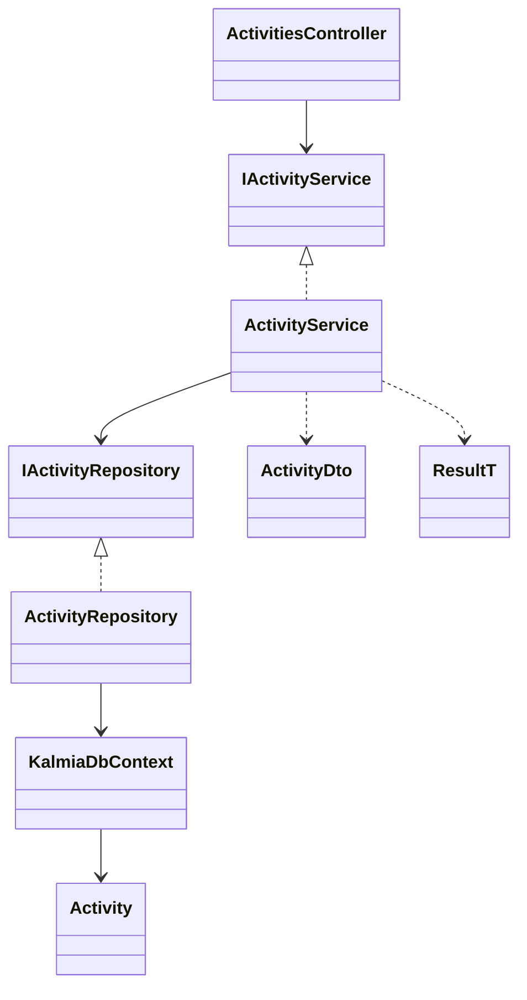
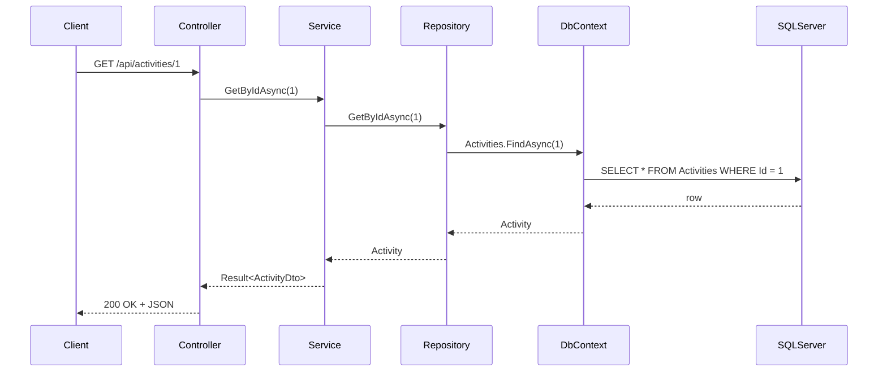

## Class relationships

```mermaid
classDiagram
    ActivitiesController --> IActivityService
    IActivityService <|.. ActivityService
    ActivityService --> IActivityRepository
    IActivityRepository <|.. ActivityRepository
    ActivityRepository --> KalmiaDbContext
    KalmiaDbContext --> Activity
    ActivityService ..> ActivityDto
    ActivityService ..> ResultT
```

## Request flow: GET /api/activities/{id}

```mermaid
sequenceDiagram
    participant Client
    participant Controller
    participant Service
    participant Repository
    participant DbContext
    participant SQLServer

    Client->>Controller: GET /api/activities/1
    Controller->>Service: GetByIdAsync(1)
    Service->>Repository: GetByIdAsync(1)
    Repository->>DbContext: Activities.FindAsync(1)
    DbContext->>SQLServer: SELECT * FROM Activities WHERE Id = 1
    SQLServer-->>DbContext: row
    DbContext-->>Repository: Activity
    Repository-->>Service: Activity
    Service-->>Controller: Result<ActivityDto>
    Controller-->>Client: 200 OK + JSON
```